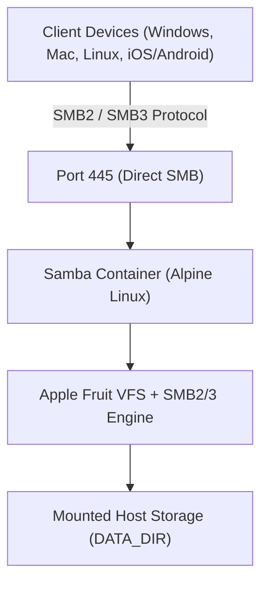

# Easy Samba Server with Docker Compose

[](https://www.docker.com/)
[](https://www.samba.org/)
[](https://alpinelinux.org/)
[]()

A lightweight, enterprise-grade, **100% host-agnostic** Samba (SMB) server powered by Docker Compose.

Runs identically across **Windows**, **macOS**, **Linux**, and NAS platforms (TrueNAS, Unraid, Synology) without requiring any host scripts, language runtimes, or OS-specific dependencies.

---

## 🏗️ Architecture



---

## 🚀 Quick Start (Zero Configuration)

Start the stack with a single command:

```bash
docker compose up -d
```

- **Shared folder:** Automatically created at `./shared`
- **Network Share Name:** `Shared`
- **Default Credentials:** `sambauser` / `samba123`
- **Guest Access:** Enabled by default for frictionless home/media device streaming

To view the live connection diagnostics and server status:
```bash
docker compose logs -f
```

---

## ⚙️ Configuration (12-Factor / `.env`)

To customize paths, credentials, or access policies without touching code, create a `.env` file (or copy `.env.example`):

```bash
cp .env.example .env
```

| Environment Variable | Default | Description |
| :--- | :--- | :--- |
| `DATA_DIR` | `./shared` | Host path to share (e.g. `./shared`, `C:/Media`, or `/mnt/data`) |
| `SAMBA_SHARE_NAME` | `Shared` | Network share name exposed to SMB clients |
| `SAMBA_USER` | `sambauser` | Samba username for authenticated access |
| `SAMBA_PASSWORD` | `samba123` | Password for user account (set for Windows 11 / macOS) |
| `SAMBA_GUEST_OK` | `yes` | Set to `no` to disable unauthenticated guest access |
| `SAMBA_READ_ONLY` | `no` | Set to `yes` to enforce read-only access |
| `PUID` / `PGID` | `1000` / `1000` | User and Group ID mapping (matches host permissions) |
| `SMB_PORT` | `445` | Direct SMB port |

---

## 📂 Connecting from Your Devices

Find your host's local IP address (e.g., `192.168.1.100`):

### 🪟 Windows (10 & 11)
1. Press `Win + R` or open **File Explorer**.
2. In the address bar, type:
   ```text
   \\<HOST_IP>\Shared
   ```
3. Enter credentials:
   - **User:** `sambauser`
   - **Password:** `samba123`  
   *(Or connect as Guest if enabled)*

> **Why authenticated credentials matter:** Modern Windows 10/11 Enterprise & Pro editions block unauthenticated guest logins by group policy (`AllowInsecureGuestAuth=0`). Providing `sambauser`/`samba123` ensures seamless out-of-the-box connectivity.

---

### 🍎 macOS
1. Open **Finder**.
2. Press `Cmd + K` (**Connect to Server**).
3. Enter:
   ```text
   smb://<HOST_IP>/Shared
   ```
4. Click **Connect** and select **Registered User** (`sambauser` / `samba123`) or **Guest**.

> **Apple Performance**: Equipped with Apple `fruit` VFS modules (`catia`, `fruit`, `streams_xattr`) to prevent `.DS_Store` lockups, accelerate Finder browsing, and support Time Machine metadata.

---

### 🐧 Linux & Home Servers
Open your file manager (Nautilus, Dolphin, Nemo) and type:
```text
smb://<HOST_IP>/Shared
```

Or mount via CLI:
```bash
sudo mount -t cifs //<HOST_IP>/Shared /mnt/samba -o username=sambauser,password=samba123
```

---

### 📱 Android & iOS
In apps like **CX File Explorer**, **Solid Explorer**, or the iOS **Files** app:
- Add a new **SMB / Windows Share** connection.
- Host: `<HOST_IP>`
- Share: `Shared`
- Authentication: `sambauser` / `samba123` (or Anonymous / Guest).

---

## 🛠️ Management & Lifecycle

- **Start server in background:**
  ```bash
  docker compose up -d
  ```
- **Stop server:**
  ```bash
  docker compose down
  ```
- **Rebuild image:**
  ```bash
  docker compose up -d --build
  ```
- **Check container health:**
  ```bash
  docker compose ps
  ```
- **Inspect live logs & connection banner:**
  ```bash
  docker compose logs -f
  ```
